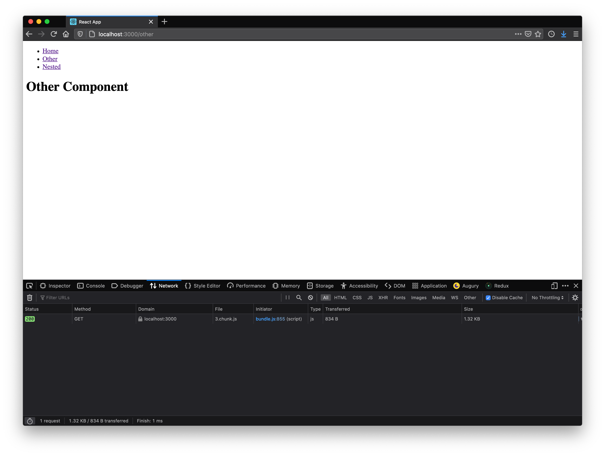

# react-bundling-example
An example repo showcasing using multiple components in a lazy loaded environment based on the code splitting example in the offical react documentation https://reactjs.org/docs/code-splitting.html#reactlazy

## Main Idea 

The main idea of this repo is to showcase a low-level example on how a "large-application" created out of multiple "smaller-applications" can be "served" without having a large bundle size by utilizing the "splitting" feature of webpack as a bundler. 

### Concept

A single application with multiple "smaller" applications inside which should not always be loaded / included in the initial loading size think of something like that: 

```
Application 
 |_ Administration
 |_ Dashboard
 |_ Service-Tools
 |_ Documentations
```

The full application has multiple apps that are supported but in some cases you dont always need all of these "apps" loaded or you dont even want that they are loaded since the inital load size would be quite large. If you are only using the dashboard app the other apps should not be loaded and only be loaded when visiting the corresponding site => Bascially "lazy-loading" these. 

Now the general size is not reduced in any way but the user is not loading files which he may never need in this case (think also about users that my never see the administration because of permissions - why would they need these bundle files?)

### Prototype Implementation

This small prototype uses the internal react future `React.lazy` and the out-of-the-box code-splitting of webpack. It also illustrates how these smaller apps can even have their own routing. 

## Testing

Simply fire up the application and inspect the network tab and see which parts of the application are only loaded when visiting any routes.




## Follow-Up

* Fallback components
* Loading indicators

